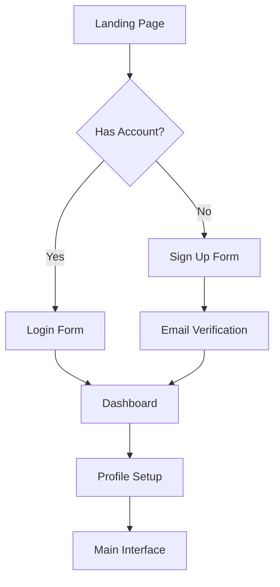
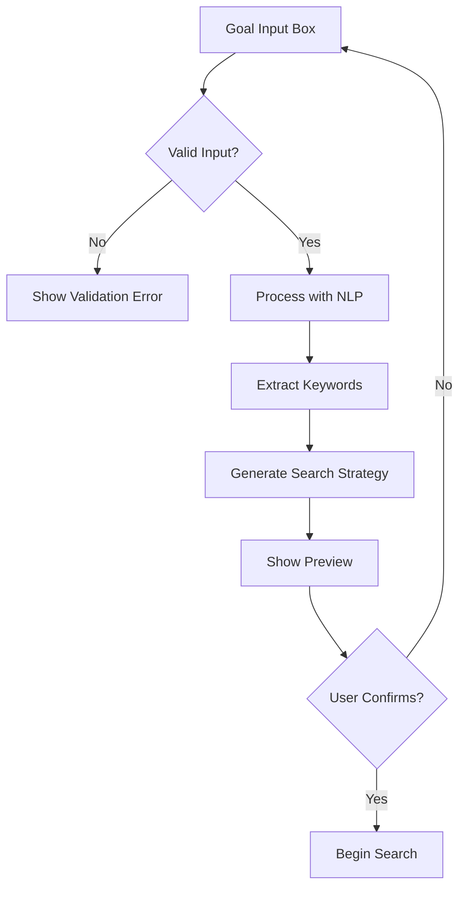
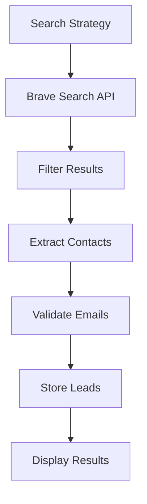
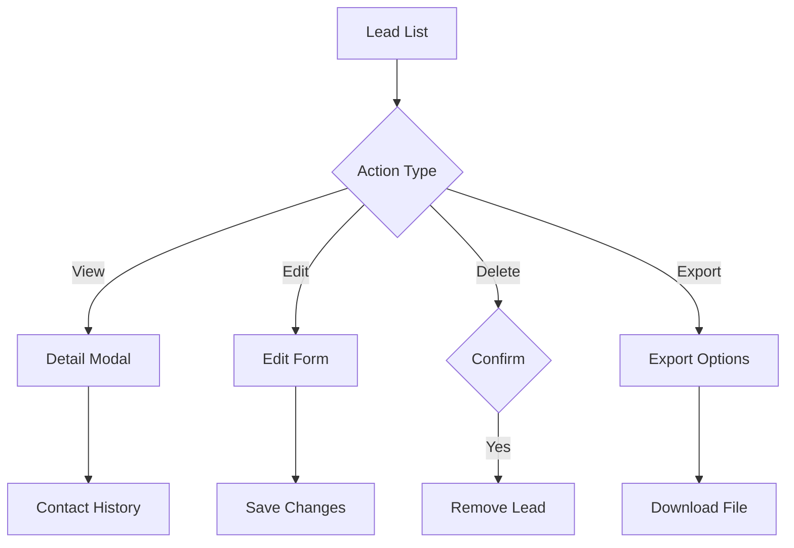
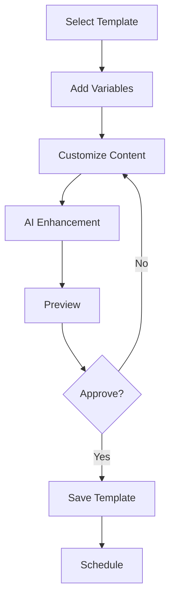
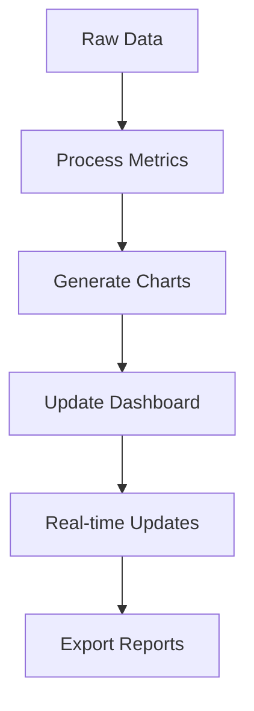
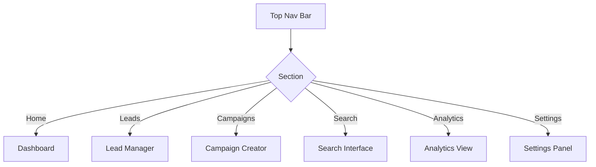
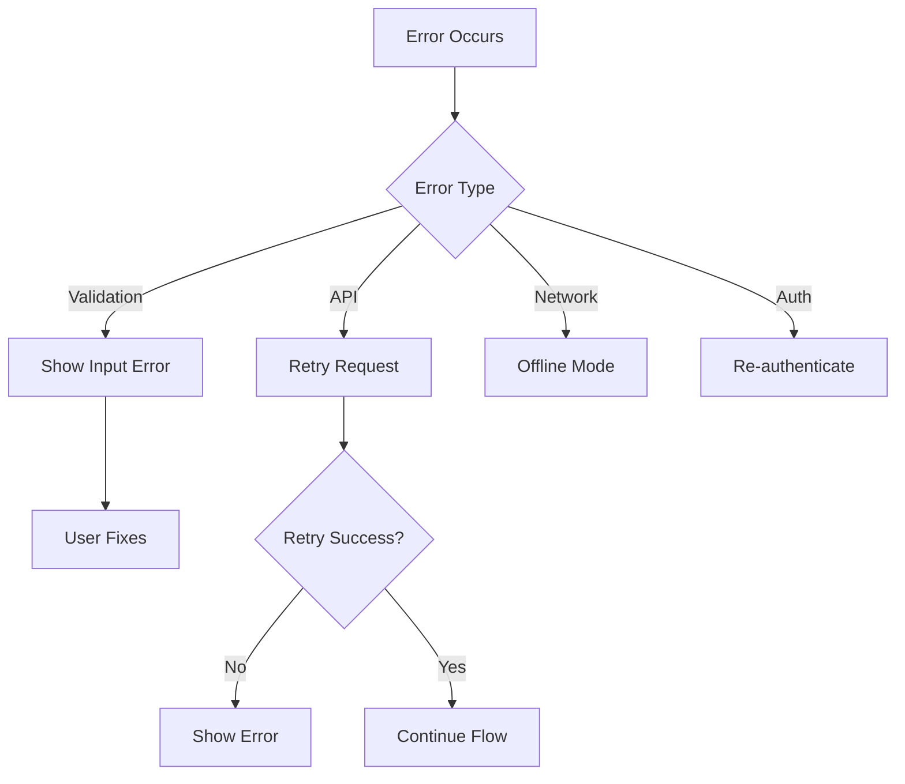
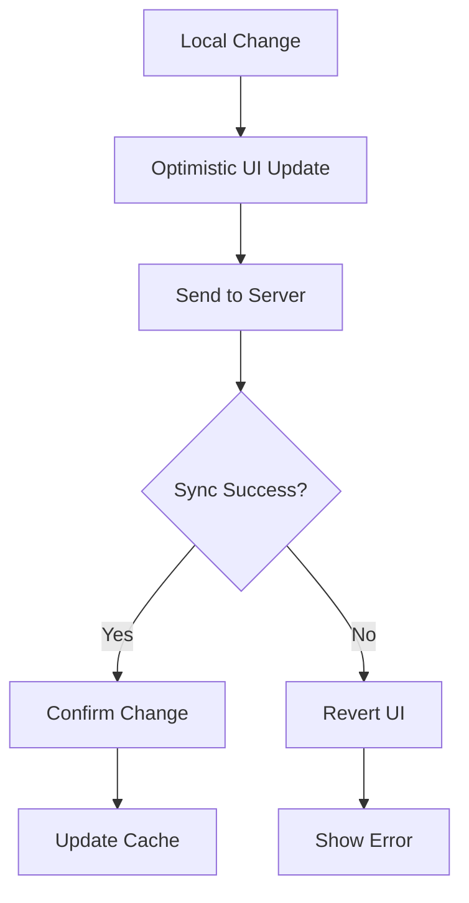

# Application Flow Documentation

This document outlines the key user flows and interface layouts in our AI-powered lead generation platform.

# User Authentication Flow

## User States
- Unauthenticated
- Email Verification Pending
- Authenticated
- Admin

## Authentication Process

# Business Goal Input Process

## Input Steps
1. Natural language goal entry
2. Real-time validation
3. Intent classification
4. Keyword extraction
5. Search strategy generation

## Input Flow

# Search Results Presentation

## Results Display
- Grid/List view toggle
- Sorting options
- Filtering sidebar
- Quick action buttons
- Pagination controls

## Search Flow

# Lead Management Interface

## Lead Actions
- View details
- Edit information
- Add notes
- Change status
- Assign tags
- Schedule follow-up
- Export data

## Management Flow

# Email Template Generation

## Template Flow
1. Select campaign type
2. Choose template base
3. Customize content
4. Add personalization
5. Preview email
6. Test send
7. Schedule campaign

## Generation Process

# Analytics Dashboard Layout

## Dashboard Sections
- Campaign overview
- Lead metrics
- Email performance
- Search analytics
- Conversion rates
- ROI calculations

## Data Flow

# Interface Navigation

## Main Navigation
- Dashboard home
- Lead management
- Campaign creator
- Search interface
- Analytics view
- Settings panel

## Navigation Flow

# Error Handling

## Error States
- Input validation errors
- API failures
- Network issues
- Authentication errors
- Permission denied
- Rate limiting

## Error Flow

# Data Synchronization

## Sync Process
- Real-time updates via Supabase
- Background data refresh
- Conflict resolution
- Offline data handling
- Change tracking

## Sync Flow
