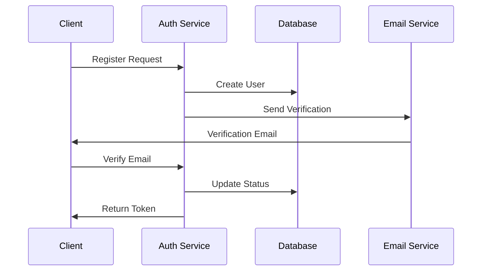
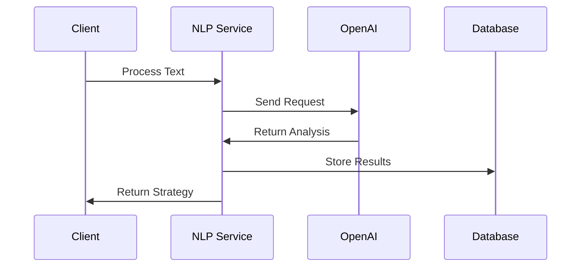
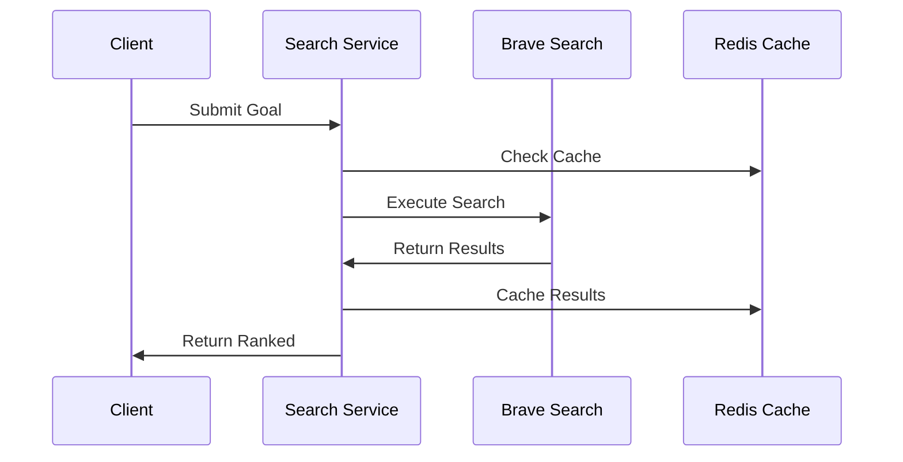
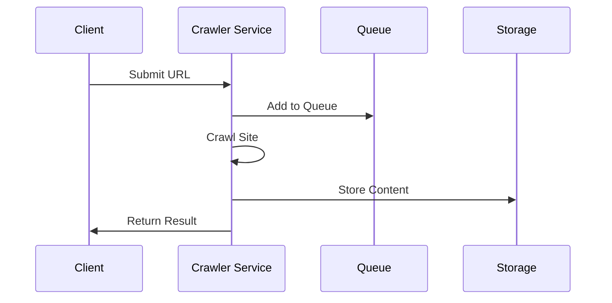
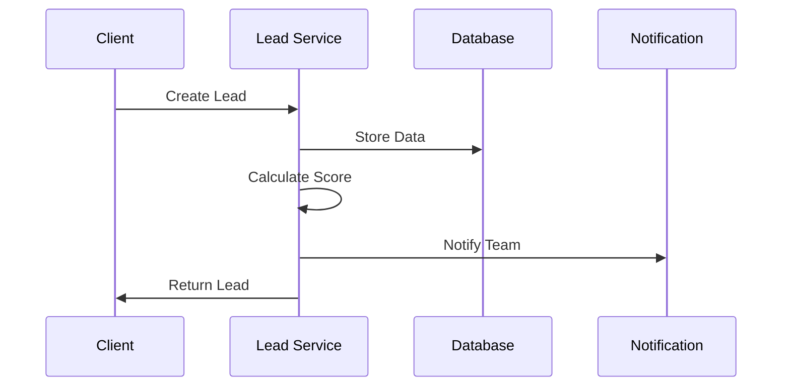

# Backend Services Documentation

This document outlines the core services that power our AI-powered lead generation platform.

# Authentication Service

## Service Architecture
- Stateless JWT-based authentication
- OAuth2 for social providers
- Redis session store
- Event-driven notifications

## Dependencies
- Supabase Auth
- Redis
- SendGrid/Mailgun
- JWT library

## API Contract
```typescript
interface AuthService {
  register(email: string, password: string): Promise<User>;
  login(email: string, password: string): Promise<Token>;
  verifyEmail(token: string): Promise<boolean>;
  resetPassword(email: string): Promise<void>;
  refreshToken(token: string): Promise<Token>;
}
```

## Data Flow


## Error Handling
- Invalid credentials
- Email already exists
- Token expired
- Rate limit exceeded
- Service unavailable

## Performance Requirements
- Registration: <500ms
- Login: <200ms
- Token refresh: <100ms
- Concurrent users: 10k+

# Natural Language Processing Service

## Service Architecture
- OpenAI integration
- Text preprocessing
- Intent classification
- Entity extraction
- Context management

## Dependencies
- OpenAI GPT-4
- Redis cache
- Text processing libraries
- Vector database

## API Contract
```typescript
interface NLPService {
  processGoal(text: string): Promise<SearchStrategy>;
  extractEntities(text: string): Promise<Entity[]>;
  classifyIntent(text: string): Promise<Intent>;
  generateResponse(context: Context): Promise<string>;
}
```

## Data Flow


## Error Handling
- Invalid input
- API limits
- Model errors
- Context missing
- Timeout issues

## Performance Requirements
- Processing time: <2s
- Concurrent requests: 1k+
- Cache hit ratio: >80%
- Token usage optimization

# Search Strategy Service

## Service Architecture
- Query generation
- Result ranking
- Location awareness
- Industry targeting
- Cache management

## Dependencies
- Brave Search API
- Redis cache
- Geolocation service
- Industry database

## API Contract
```typescript
interface SearchService {
  generateStrategy(goal: Goal): Promise<Strategy>;
  executeSearch(strategy: Strategy): Promise<Result[]>;
  rankResults(results: Result[]): Promise<RankedResult[]>;
  validateResults(results: Result[]): Promise<ValidatedResult[]>;
}
```

## Data Flow


## Error Handling
- Invalid strategy
- API limits
- No results
- Cache miss
- Validation failed

## Performance Requirements
- Strategy generation: <1s
- Search execution: <3s
- Result ranking: <500ms
- Cache efficiency: >90%

# Website Crawler Service

## Service Architecture
- Depth-first crawling
- Rate limiting
- Content extraction
- XML storage
- Metadata parsing

## Dependencies
- Puppeteer/Playwright
- Redis queue
- Storage service
- URL validator

## API Contract
```typescript
interface CrawlerService {
  crawlWebsite(url: string, depth: number): Promise<CrawlResult>;
  extractContent(url: string): Promise<Content>;
  validateURL(url: string): Promise<boolean>;
  storeContent(content: Content): Promise<string>;
}
```

## Data Flow


## Error Handling
- Invalid URL
- Rate limited
- Network errors
- Storage full
- Parsing failed

## Performance Requirements
- Crawl speed: 5 pages/s
- Depth limit: 2 levels
- Storage efficiency
- Queue management

# Email Extraction Service

## Service Architecture
- Pattern matching
- Validation rules
- Deliverability check
- Duplicate detection
- Blacklist checking

## Dependencies
- Email validator
- DNS resolver
- Blacklist service
- Pattern library

## API Contract
```typescript
interface EmailService {
  extractEmails(content: string): Promise<Email[]>;
  validateEmail(email: string): Promise<boolean>;
  checkDeliverability(email: string): Promise<boolean>;
  storeEmail(email: Email): Promise<void>;
}
```

## Data Flow


## Error Handling
- Invalid format
- DNS failures
- Blacklisted
- Duplicates
- Storage errors

## Performance Requirements
- Extraction: <100ms
- Validation: <1s
- Storage: <50ms
- Batch processing

# Lead Management Service

## Service Architecture
- Lead scoring
- Status tracking
- History management
- Tag system
- Export functionality

## Dependencies
- Database
- Scoring algorithm
- Export service
- Notification system

## API Contract
```typescript
interface LeadService {
  createLead(data: LeadData): Promise<Lead>;
  updateLead(id: string, data: Partial<LeadData>): Promise<Lead>;
  scoreLead(id: string): Promise<number>;
  exportLeads(filter: Filter): Promise<Export>;
}
```

## Data Flow


## Error Handling
- Invalid data
- Duplicate lead
- Score error
- Export failed
- Update conflict

## Performance Requirements
- Creation: <200ms
- Updates: <100ms
- Scoring: <500ms
- Export speed: 1k/s 