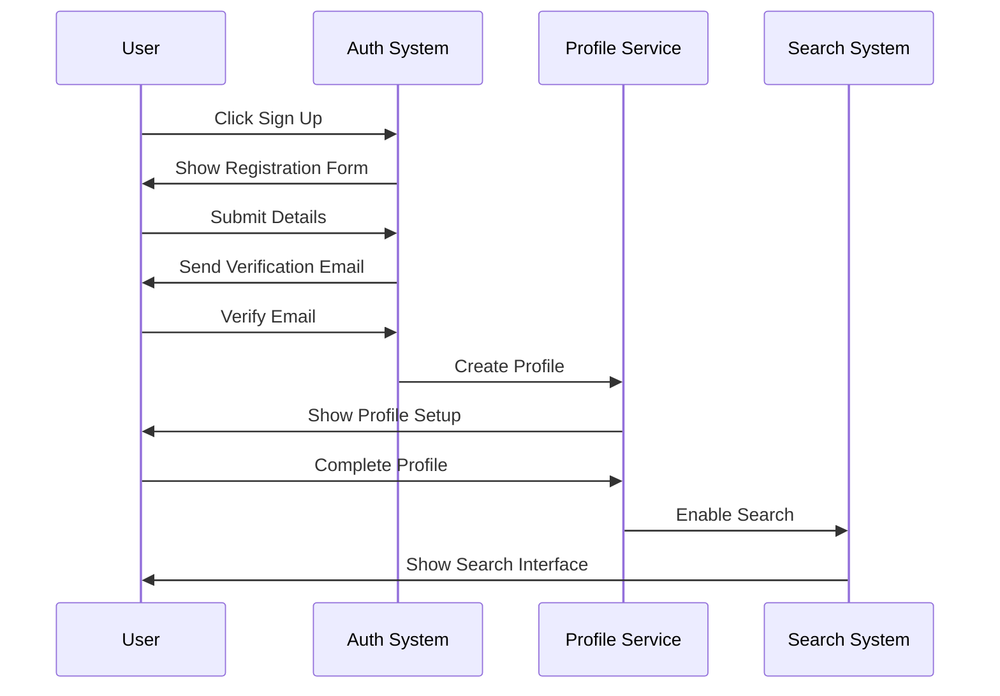
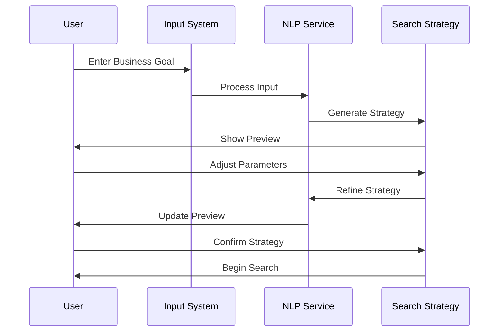
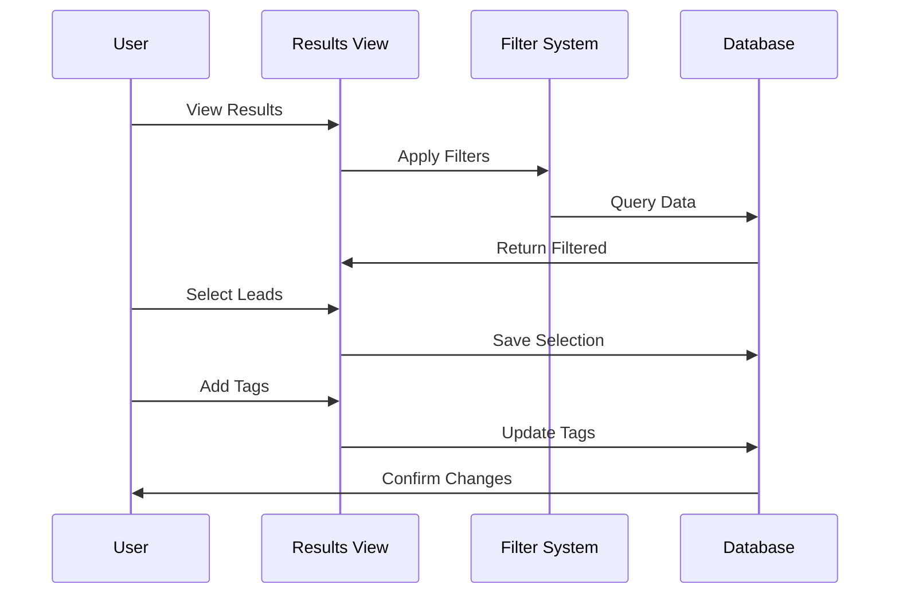
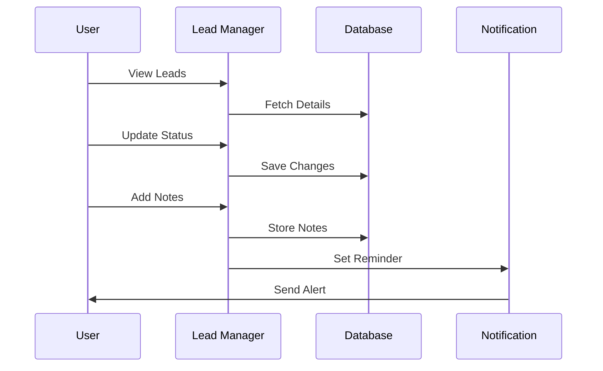
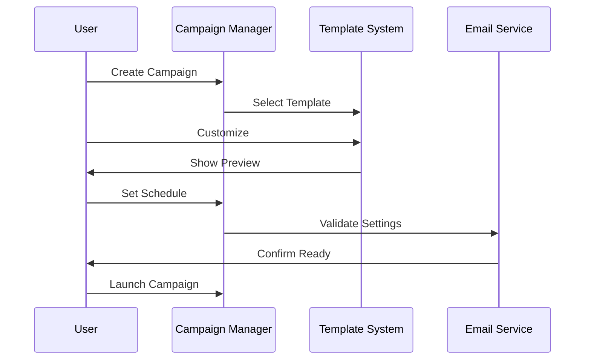
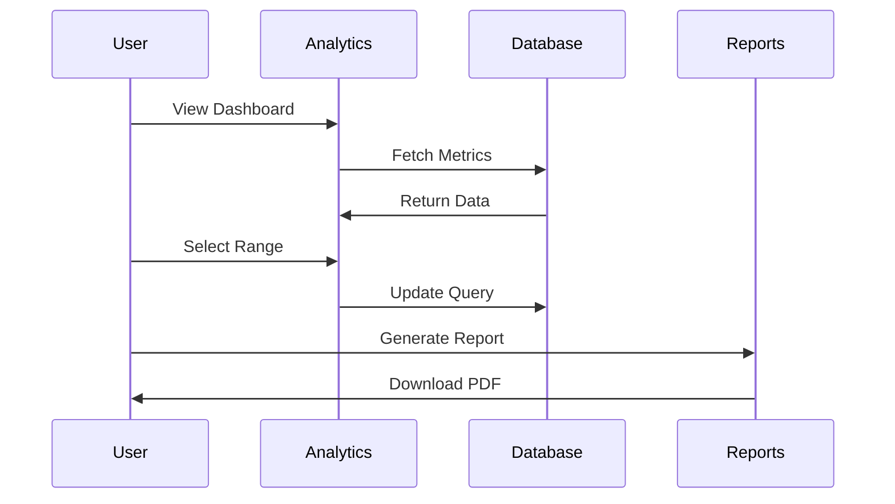
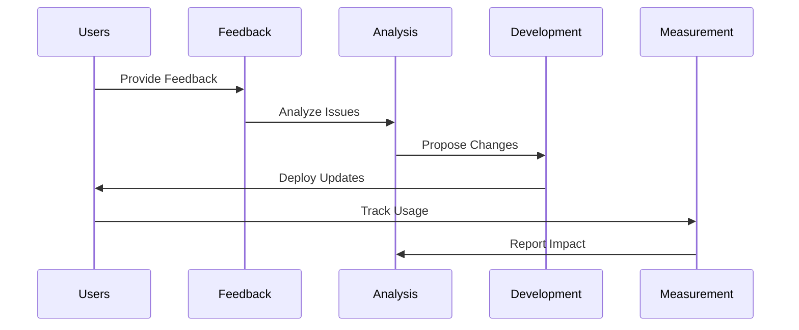

# User Journey Documentation

This document outlines the key user journeys in our AI-powered lead generation platform, including detailed steps, success criteria, and potential pain points.

# New User Onboarding

## User Persona
- Small business owner or startup founder
- Limited time for manual lead generation
- Basic technical proficiency
- Goal: Quickly start finding relevant leads

## Journey Steps
1. Land on homepage
2. Click "Get Started"
3. Choose authentication method
4. Complete registration
5. Verify email
6. Set up organization profile
7. Enter business goals
8. Start first search

## Success Criteria
- Registration completed in <3 minutes
- Email verified within 5 minutes
- Organization profile completed
- First search initiated

## Pain Points
- Email verification delays
- Complex organization setup
- Unclear next steps
- Information overload

## Improvement Opportunities
- Streamline registration process
- Provide guided tour
- Show progress indicators
- Offer template profiles

## Journey Sequence

# Business Goal Submission

## User Persona
- Existing platform user
- Has specific target market
- Wants precise lead matching
- Goal: Generate qualified leads

## Journey Steps
1. Navigate to goal input
2. Enter business description
3. Specify target market
4. Add location preferences
5. Review generated strategy
6. Adjust parameters
7. Confirm and start

## Success Criteria
- Clear goal articulation
- Accurate strategy generation
- Relevant search parameters
- Quick iteration cycle

## Pain Points
- Unclear input format
- Complex industry terms
- Strategy misalignment
- Long processing times

## Improvement Opportunities
- Provide example inputs
- Add industry templates
- Show real-time feedback
- Implement auto-save

## Journey Sequence

# Search Result Review

## User Persona
- Active platform user
- Reviewing multiple leads
- Needs quick filtering
- Goal: Identify best prospects

## Journey Steps
1. View search results
2. Apply filters
3. Sort by relevance
4. Review lead details
5. Save promising leads
6. Tag for follow-up
7. Export selection

## Success Criteria
- Fast result loading
- Accurate filtering
- Easy lead saving
- Efficient tagging

## Pain Points
- Overwhelming results
- Slow loading times
- Unclear relevance
- Complex filtering

## Improvement Opportunities
- Add bulk actions
- Implement quick preview
- Show relevance scores
- Add custom filters

## Journey Sequence

# Lead Management

## User Persona
- Sales team member
- Managing multiple leads
- Tracking interactions
- Goal: Convert leads to clients

## Journey Steps
1. Access lead dashboard
2. Review lead status
3. Update information
4. Add interaction notes
5. Schedule follow-ups
6. Track responses
7. Update pipeline

## Success Criteria
- Organized lead view
- Easy status updates
- Clear interaction history
- Automated tracking

## Pain Points
- Data inconsistency
- Manual updates
- Missing information
- Status confusion

## Improvement Opportunities
- Add bulk updates
- Automate status changes
- Implement reminders
- Add data validation

## Journey Sequence

# Outreach Campaign Creation

## User Persona
- Marketing manager
- Creating email campaigns
- Personalizing content
- Goal: High engagement rates

## Journey Steps
1. Create campaign
2. Select template
3. Customize content
4. Add personalization
5. Set schedule
6. Review settings
7. Launch campaign

## Success Criteria
- Easy template selection
- Smooth customization
- Clear preview
- Successful launch

## Pain Points
- Limited templates
- Complex personalization
- Preview issues
- Scheduling confusion

## Improvement Opportunities
- Add template library
- Improve personalization
- Enhanced preview
- Flexible scheduling

## Journey Sequence

# Performance Tracking

## User Persona
- Business analyst
- Monitoring metrics
- Generating reports
- Goal: Optimize ROI

## Journey Steps
1. Open analytics
2. Select date range
3. View key metrics
4. Generate reports
5. Analyze trends
6. Export data
7. Share insights

## Success Criteria
- Real-time updates
- Accurate metrics
- Clear visualizations
- Easy export

## Pain Points
- Data lag
- Complex metrics
- Limited exports
- Missing insights

## Improvement Opportunities
- Add real-time data
- Simplify metrics
- Enhanced exports
- AI insights

## Journey Sequence

# Journey Optimization

## Continuous Improvement Process
1. Collect user feedback
2. Analyze pain points
3. Identify solutions
4. Implement changes
5. Measure impact
6. Iterate improvements

## Measurement Metrics
- Time to complete
- Error rates
- User satisfaction
- Feature adoption
- Support tickets
- User retention

## Optimization Flow
